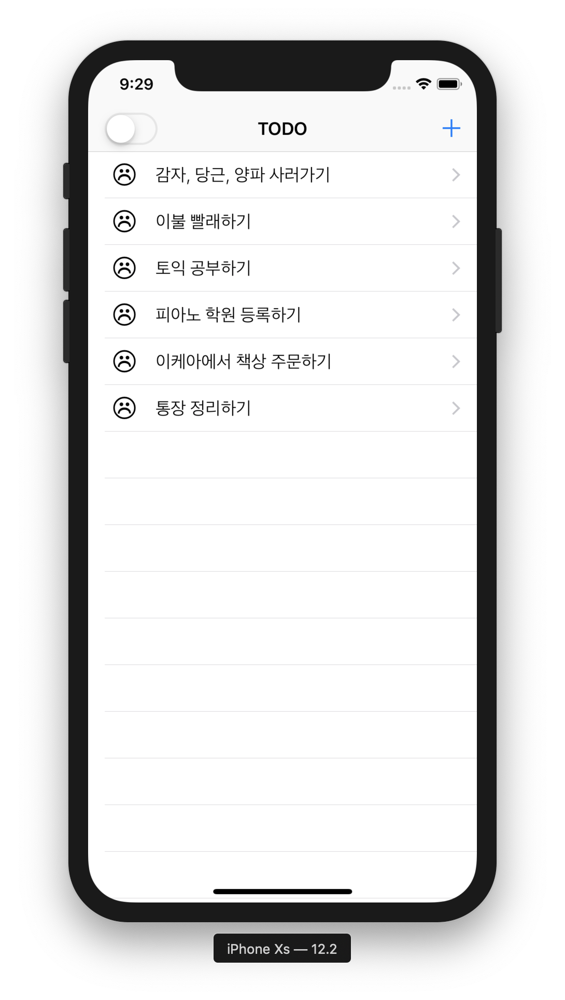

## Recover TodoList
MVVM 패턴을 적용하여 리메이크한 간단한 todo앱입니다.
간단한 todo 저장, 조회 등의 기능을 제공합니다.

 

### features

1. todo 조회

2. todo 추가 및 변경

3. todo 삭제

4. todo 완료

5. 완료하지 않은 todo 목록만 보기

 

### 달라진 점

1. MVVM 패턴을 적용하였다.
2. Delegate, Single Tone Pattern 을 적용하였다.
3. 기능이 추가 되었다.

 

### Style Guide
    - Swift Code Convention
    - Swift Dev Version : 5.0.1
    - Architecture : MVVM
    - Design : Delegate, Single tone

 

 

------------------------------------------
## ios 첫 프로젝트 TodoList

### Features
* 할 일을 관리하는 생활 앱
 1. Todo 저장
 2. Todo 조회
 3. Todo 삭제

### Style Guide
    - Swift Code Convention
    - Swift Dev Version : 5.0.1
